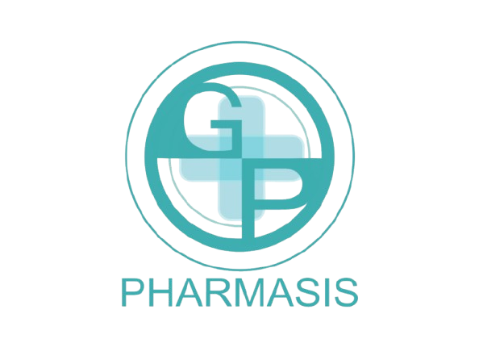

<div align="center">
  
  <h1>Pharmasis</h1>
  <p><strong>AI-Powered Medical Intelligence & Interaction Checker</strong></p>
</div>

---

**Pharmasis** is a modern, responsive web application designed for educational purposes. It empowers users to search for medications, understand complex medical jargon through AI simplification, and robustly verify safety risks using a Multi-Drug Interaction Intelligence engine.


---

## ✨ Core Features

### 1. Multi-Drug Interaction Intelligence
A powerful safety-checking tool that analyzes the combinatorial risks of up to 10 different medications simultaneously.
- **Dynamic Risk Assessment:** Flags combinations as Minor, Moderate, Major, or Unknown risk.
- **AI Summarization:** Condenses dense medical interaction records into easy-to-read safety warnings.
- **AI Inference Fallback:** If direct database records are missing, the system uses Scaleway AI to infer potential risks based on pharmacological drug classes.
- **Interactive UI:** Features a premium, card-free interface with debounced autocomplete, selectable drug chips, risk-color-coded badges, and pairwise accordion breakdowns.

### 2. AI Medical Content Simplifier
Medical jargon from sources like the FDA can be incredibly difficult for the average person to understand.
- **Jargon Translation:** Users can click a button on any drug detail page to get an instant, plain-language summary of complex concepts (like Boxed Warnings, Adverse Reactions, or Indications).
- **Powered by Scaleway:** Uses high-performance Open-Weight language models (like Meta's Llama 3) via the Scaleway AI endpoint to provide structured, safe, and easily digestible bullet points.

### 3. High-Performance Instant Search
- **Fuzzy Matching:** Built on PostgreSQL's `pg_trgm` extension for ultra-fast, typo-tolerant full-text search across thousands of drug names and generics.
- **Autocomplete Dropdown:** Real-time search suggestions with a 300ms debounce directly in the navigation bar.

### 4. Premium Responsive Design
- **Modern Aesthetics:** Utilizes glassmorphism concepts, custom fonts (`Plus Jakarta Sans`, `Syne`, `Mothwing`), and smooth `CSS`/`Alpine.js` transitions.
- **Mobile-First:** Fully responsive layouts with off-canvas hamburger menus and touch-friendly search dropdowns.

---

## 🛠️ Tech Stack

### Backend
- **Framework:** Laravel 10 (PHP 8.2+)
- **Database:** PostgreSQL
- **Extensions:** `pg_trgm` (for Advanced Text Search & Trigram similarity)
- **External Data Source:** [OpenFDA APIs](https://open.fda.gov/) (for comprehensive drug labeling and interaction data)

### Frontend
- **Templating:** Laravel Blade Components
- **Interactivity:** [Alpine.js](https://alpinejs.dev/) (Lightweight, reactive JavaScript framework for dropdowns, modals, and dynamic data fetching without the overhead of React/Vue)
- **Styling:** [Tailwind CSS](https://tailwindcss.com/) (Utility-first CSS framework via custom configuration for rapid UI styling)
- **Icons:** Inline SVG icons tailored for a modern look.

### Artificial Intelligence
- **LLM Provider:** Scaleway AI Inference (`llama-3.3-70b-instruct`)
- **Integration:** API consumed securely via backend Services (`AiInteractionService.php`, `AiSimplifierService.php`) with 30-day response caching to optimize quota usage and speed.

---

## 🚦 System Architecture & Workflows

### **Interaction Intelligence Workflow**
1. **Input:** User searches and selects $N$ drugs (up to 10).
2. **Combinatorics:** Backend generates all unique $N(N-1)/2$ pairs.
3. **Database Check:** For each pair, queries local PostgreSQL interactions table using trigram similarity.
4. **AI Processing:**
   - *If Match Found (Summarization Mode):* Passes raw medical text to Scaleway AI to summarize simply and assign a risk level.
   - *If No Match (Inference Mode):* Passes the two drug classes to Scaleway AI to infer a conservative, hypothetical safety risk.
5. **Output Aggregation:** Calculates overall maximum risk level across all pairs and streams a structured JSON response to the Alpine.js frontend.

---

## 🚀 Local Development Setup

### Prerequisites
- PHP 8.2+
- Composer
- PostgreSQL
- Node.js & NPM (optional, for asset bundling if needed)

### Installation

1. **Clone the repository**
   ```bash
   git clone https://github.com/your-repo/pharmasis.git
   cd pharmasis
   ```

2. **Install PHP dependencies**
   ```bash
   composer install
   ```

3. **Configure Environment**
   ```bash
   cp .env.example .env
   php artisan key:generate
   ```
   Update the `.env` file with your database credentials:
   ```env
   DB_CONNECTION=pgsql
   DB_HOST=127.0.0.1
   DB_PORT=5432
   DB_DATABASE=pharmasis
   DB_USERNAME=your_user
   DB_PASSWORD=your_password
   ```

4. **Configure AI Providers**
   Add your Scaleway API key to `.env` to enable the AI Simplifier and Interaction inference features:
   ```env
   OPENAI_API_KEY=your_scaleway_iam_secret_key_here
   OPENAI_API_BASE=https://api.scaleway.ai/72d6b375-b838-47b0-9fbb-ccf253147079/v1
   OPENAI_MODEL=llama-3.3-70b-instruct
   ```

5. **Run Migrations & Seeders**
   Ensure the `pg_trgm` extension is enabled in your PostgreSQL database, then run:
   ```bash
   php artisan migrate
   ```

6. **Serve the Application**
   ```bash
   php artisan serve
   ```
   Visit `http://localhost:8000` in your browser.

---

## ⚠️ Disclaimer
**Educational Use Only.** Pharmasis is an educational and portfolio project. The interaction checks and AI-simplified texts do **NOT** replace professional medical advice. Algorithms and AI integrations can hallucinate or omit critical hazards. Always consult a licensed healthcare provider or pharmacist regarding medication safety.
